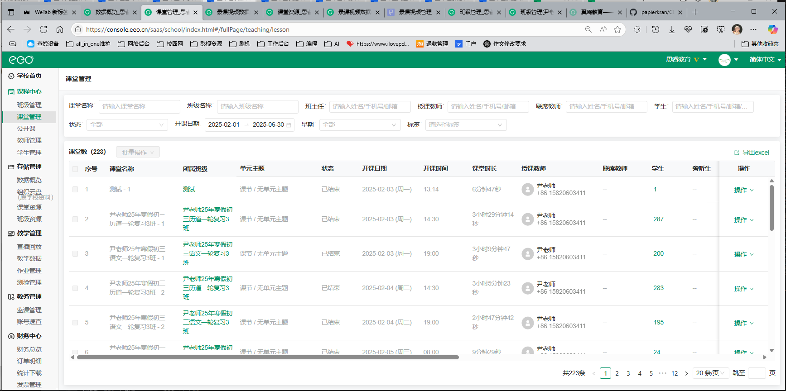

# ClassIn 视频下载器 - 使用说明

本项目用于自动化下载 **ClassIn 平台课程视频**，通过 Selenium 模拟登录状态，并批量下载 CSV 文件中指定课程的录播视频。

---

## 功能介绍
- 自动读取 CSV 文件中的课程信息（课程ID、课节ID等）
- 自动登录 ClassIn 平台（基于 Cookie 模拟登录）
- 获取课程详情和视频下载链接
- 自动下载课程视频到指定目录，避免文件重名覆盖

---

## 环境依赖

- Python 3.8+
- 依赖库：
  ```bash
  pip install selenium requests webdriver-manager
  ```

- 浏览器驱动：
  - 需要 **Microsoft Edge 浏览器**
  - 驱动路径可通过 `webdriver_manager` 自动下载，或者手动设置 `msedgedriver.exe` 路径

---

## 目录结构
```
project/
│
├── downloader.py     # 主程序
├── courses.csv       # 存储课程信息的 CSV 文件
└── Y:\video\       # 下载的视频保存目录（进入代码修改为你自己的位置）
```

---

## CSV 文件格式

CSV 至少包含以下列：

| 课堂ID  | 班级ID  | 课节名称  | 课程名称  | 开课时间  |
|--------|--------|----------|----------|---------|

前三行会被忽略，从第四行开始读取。

---

## 核心配置说明

### **1. Edge 驱动路径**
```python
service = Service(executable_path='E:\project\python\Classin_Video_Downloader_Python\edgedriver_win64\msedgedriver.exe')
```
> 如果不想手动设置，可以用 `webdriver_manager` 自动管理：
```python
from webdriver_manager.microsoft import EdgeChromiumDriverManager
service = Service(EdgeChromiumDriverManager().install())
```

### **2. Cookie 设置**
```python
cookie_str = "key=value; key2=value2; ..."
```
- 登录 **ClassIn 控制台** 后，打开浏览器开发者工具 → Application → Cookies，复制整个 Cookie 字符串粘贴到代码中。

---

## 使用步骤

### **1. 修改配置**
- 确认 `cookie_str` 里的 Cookie 正确
- 修改保存路径：
```python
SAVE_DIR = "Y:\video"
```

### **2. 准备 CSV 文件**

- 右边导出后并改名`courses.csv`，需要移动到和本代码一个目录中
- 将课程信息保存到 `courses.csv`，并放在程序同级目录

### **3. 运行程序**
```bash
python downloader.py
```

### **4. 程序运行后：**
- 自动登录 ClassIn 平台
- 根据 CSV 逐一访问课程下载页面
- 抓取视频链接并下载到指定目录

---

## 注意事项
- Cookie 有效期有限，如果过期需重新复制
- 下载速度取决于网络环境和服务器响应
- 如果页面加载慢，可以适当增加 `time.sleep()` 时间

---

## 可能遇到的问题
1. **无法加载视频列表**
   - 检查 Cookie 是否正确
   - 检查页面 XPath 是否与当前页面一致

2. **下载失败**
   - 检查 `download_url` 是否可直接访问
   - 尝试在浏览器粘贴链接验证

---

## TODO
- 增加异常重试逻辑
- 支持多线程下载
- 增加日志记录功能


