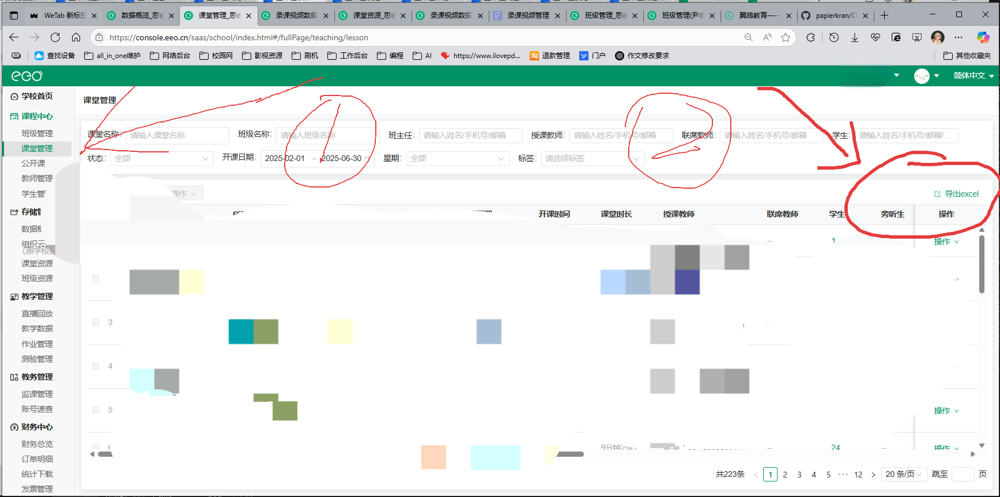

# ClassIn 视频下载器

一个用于 **批量下载 ClassIn 课堂录播视频** 的桌面工具，带图形界面，支持导入课程数据、保存配置、自动检测浏览器并自动下载匹配驱动。

## 功能特性

- 图形界面操作，适合日常直接使用
- 支持导入 `CSV / XLSX / XLS` 课程数据
- 支持粘贴 Cookie 登录态进行下载
- 自动检测本机浏览器（优先 Edge，其次 Chrome/Chromium）
- 运行时可通过 `webdriver-manager` 自动获取匹配驱动
- 支持批量任务列表、进度显示、日志输出
- 支持多线程并发下载（1-8线程可配置）
- 支持暂停/继续/停止下载
- 自动获取 Cookie（登录后自动保存）
- 支持打包为 `.exe`

---

## 文件夹结构说明

下载的视频会按照以下结构组织：

```
保存目录/
├── {首次开课日期}_{班级名称}/          # 一级目录：班级
│   ├── {开课时间}_{课堂名称}/          # 二级目录：课堂
│   │   ├── 2026-03-20_课程名_录制方式_片段名.mp4
│   │   ├── 2026-03-20_课程名_录制方式_片段名_1.mp4
│   │   └── ...
│   └── {开课时间}_{课堂名称}/
│       └── ...
└── ...
```

**命名规则：**
- **一级目录**：`{该班级首次开课日期}_{班级名称}`（如 `2026-03-20_示例班级A`）
- **二级目录**：`{课堂开课时间}_{课堂名称}`（如 `2026-03-20_19-00_示例课堂A`）
- **视频文件**：`{录制日期}_{课程名}_{录制方式}_{片段名}.mp4`

---

## 项目主要文件

| 文件 | 说明 |
|------|------|
| `gui.py` | 图形界面入口 |
| `videodownloader.py` | 下载主逻辑 |
| `driver_auto.py` | 浏览器与 WebDriver 自动检测/下载 |
| `cookie.py` | Cookie 获取辅助脚本 |
| `config.json` | 运行时配置文件（自动生成） |
| `videodata/` | 示例或导入用数据目录 |
| `image/` | 说明图片等资源 |
| `ClassIn视频下载器.spec` | PyInstaller 打包配置 |

---

## 运行环境

- Python 3.10+
- Windows 下推荐使用（最终目标是打包 exe）
- 需要本机安装以下浏览器之一：
  - Microsoft Edge
  - Google Chrome
  - Chromium

## 依赖安装

```bash
pip install selenium requests webdriver-manager openpyxl pyinstaller
```

---

## 使用方式

### 1. 准备课程数据



从 ClassIn 后台导出课程统计数据，支持以下格式：
- `.csv`
- `.xlsx`
- `.xls`

**必需字段：**
- `课堂ID`
- `班级ID`
- `课堂名称`
- `班级名称`
- `开课时间`
- `创建时间`

### 2. 启动程序

```bash
python gui.py
```

### 3. 配置下载参数

在界面中填写或选择：
- **浏览器驱动路径**：可留空，程序自动处理
- **视频保存目录**：选择视频保存位置
- **数据文件路径**：导入课程数据文件
- **Cookie**：粘贴登录态 Cookie
- **下载线程数**：1-8，默认4

### 4. 获取 Cookie

方式一：点击"获取 Cookie"按钮，程序会自动打开浏览器，登录后自动保存

方式二：手动从浏览器开发者工具复制 Cookie 粘贴到输入框

> 注意：Cookie 有时效，过期后需要重新获取。

### 5. 管理任务列表

- **导入 CSV/XLSX**：从文件导入课程数据
- **新增行**：手动添加任务
- **编辑行**：修改选中任务
- **删除行**：删除选中任务

### 6. 开始下载

点击"开始下载"，程序会：
1. 检测可用浏览器
2. 自动准备驱动
3. 加载课程数据
4. 逐条获取录播地址
5. 多线程并发下载视频到指定目录

**控制按钮：**
- **暂停/继续**：暂停或继续下载
- **停止**：终止下载任务

---

## 配置文件说明

程序会自动生成 `config.json` 保存配置：

```json
{
  "driver_path": "",
  "save_dir": "D:\\Videos",
  "csv_file": "C:\\path\\to\\courses.csv",
  "cookie": "your_cookie_here",
  "max_workers": "4"
}
```

---

## 打包 exe

### 推荐方式

```bash
python -m PyInstaller ClassIn视频下载器.spec --noconfirm
```

### 打包说明

当前 spec 已调整为：
- 自动打包 `image/` 资源目录
- 保留 Selenium / Requests / webdriver-manager 所需依赖

打包完成后，生成结果位于：`dist/ClassIn视频下载器.exe`

---

## 常见问题

### 1）找不到浏览器
请确认本机已安装 Edge、Chrome 或 Chromium。

### 2）Cookie 无效
请重新登录后台并复制最新 Cookie。

### 3）下载失败
常见原因：
- Cookie 过期
- 课堂页面结构变化
- 网络波动
- 某条视频下载链接失效

### 4）驱动相关报错
程序默认会尝试自动处理驱动；如果自动获取失败，再手动指定驱动路径。

---

## License

本项目使用仓库内附带的 `LICENSE`。
